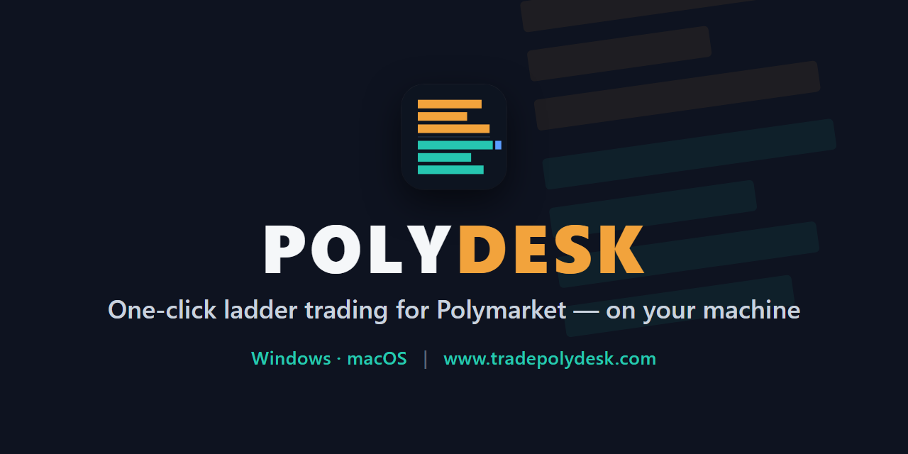

<p align="center">
  
</p>

# POLYDESK clicktrader - ladder trading desktop app for Polymarket

**Website: [www.tradepolydesk.com](https://www.tradepolydesk.com)**

[](https://github.com/itereon-dev/polydesk-clicktrader-releases/releases/latest)

polydesk clicktrader (POLYDESK clicktrader) is a desktop trading cockpit for [Polymarket](https://polymarket.com): a
one-click price ladder in the style of exchange trading tools (Geeks Toy, Bet Angel),
with quick take, quick cancel, stake presets, hedging and cash-out figures, position and
P&L tracking — built for traders who want to click on a price, not fill in a form.

It runs on **your** computer. Your keys and funds never leave your control; nobody
places orders on your behalf. polydesk clicktrader is independent software by itereon GmbH and is **not
affiliated with or endorsed by Polymarket**. Guides: [ladder trading](https://www.tradepolydesk.com/ladder-trading),
[the Grid](https://www.tradepolydesk.com/grid-trading), [tutorial](https://www.tradepolydesk.com/tutorial),
[changelog](https://www.tradepolydesk.com/changelog).

<!--  -->

This repository is the official **download and support** channel. The application
itself is closed-source — there is no source code here, only releases, checksums,
and a place to ask questions and report problems.

---

## Download

These links always point at the **current stable version**:

| System | Download | Also on the release page as |
|---|---|---|
| **Windows 10 / 11** (64-bit) | [polydesk-windows-x64-setup.exe](https://github.com/itereon-dev/polydesk-clicktrader-releases/releases/latest/download/polydesk-windows-x64-setup.exe) — recommended | `polydesk_<version>_x64-setup.exe` |
| Windows (IT-managed installs) | [polydesk-windows-x64.msi](https://github.com/itereon-dev/polydesk-clicktrader-releases/releases/latest/download/polydesk-windows-x64.msi) | `polydesk_<version>_x64_en-US.msi` |
| **macOS** (Apple Silicon — M1 or newer) | [polydesk-macos-arm64.dmg](https://github.com/itereon-dev/polydesk-clicktrader-releases/releases/latest/download/polydesk-macos-arm64.dmg) | `polydesk_<version>_aarch64.dmg` |
| Checksums | [SHA256SUMS.txt](https://github.com/itereon-dev/polydesk-clicktrader-releases/releases/latest/download/SHA256SUMS.txt) | |

All versions, release notes and older downloads:
**[Releases](https://github.com/itereon-dev/polydesk-clicktrader-releases/releases)**.
Each release carries every installer twice — under the fixed name above and under a
versioned name; the files are identical.

Not available: Intel Macs, Linux. Pre-releases (`-beta`) are marked as such and never
served by the links above — use them only if you were asked to test.

### Installing (unsigned builds — read this once)

The installers are not yet code-signed, so both operating systems warn on first launch.
This is expected and not a sign of a bad download — **verify the checksum** (next
section) and then:

- **macOS:** open the `.dmg`, drag **polydesk** to *Applications*. On first launch
  Gatekeeper reports *"polydesk.app is damaged and can't be opened"* — that is the
  quarantine flag on an unsigned app, not damage. Run once in Terminal:
  `xattr -cr /Applications/polydesk.app` — then open the app normally.
- **Windows:** SmartScreen shows *"Windows protected your PC"* → **More info** →
  **Run anyway**.

### Verify your download

Every release ships a `SHA256SUMS.txt` generated by our build pipeline from the exact
files published (it lists both the fixed and the versioned file names — same hash).
Compare its line for your file with the hash of what you downloaded:

```powershell
# Windows (PowerShell)
Get-FileHash .\polydesk-windows-x64-setup.exe -Algorithm SHA256
```

```bash
# macOS (Terminal)
shasum -a 256 ~/Downloads/polydesk-macos-arm64.dmg
```

If the hash differs, delete the file and download again from this page only.

---

## First start

1. **Setup guide.** The app opens a short guided setup: accept the disclaimer, check
   your Polymarket balance, import the key of your **dedicated trading wallet**, choose
   **PAPER** or **LIVE**, set your hard limits. You can re-run it any time from the
   account menu (top right) → *Setup guide…*.
2. **PAPER mode is the default.** Paper trading simulates fills against the real
   market — nothing is at risk. Learn the ladder there first.
3. **LIVE** places real orders with real money. Fund the trading wallet only with what
   you are willing to risk; never import your main wallet.
4. The in-app **? GUIDE** (footer, English and German) explains every element of the
   cockpit: markets, ladder, stakes, tickets, hedging, positions, odds formats,
   shortcuts.

## How your keys and money are protected

- **Non-custodial.** Your wallet key is stored by your operating system's keychain
  (macOS Keychain / Windows Credential Manager), never in a file, never sent anywhere.
  *Remove key* deletes it. Orders are signed on your machine by the trading engine that
  ships inside the app.
- **Hard limits.** Maximum stake per order, maximum open orders and maximum exposure
  per market are enforced by the engine (defaults $10 · 5 · $20). The interface cannot
  loosen them; raising them is a deliberate, manual step described in the guide.
- **Kill switch.** *CANCEL ALL* and **ESC** cancel every working order, armed or not.
  Nothing trades until you arm the app (SPACE); it starts disarmed.
- **Releases contain no credentials.** Everything personal is entered by you at first
  run and stays on your device.

## Requirements

- Windows 10/11 64-bit, or macOS on Apple Silicon.
- A Polymarket account with funds in its deposit wallet, and a dedicated trading
  wallet key for POLYDESK (the setup guide walks you through it).
- An internet connection **from a jurisdiction where Polymarket permits trading**.
  Polymarket decides this from your connection, not the app: in restricted regions
  (for example Germany or the US) only closing positions is possible. Do **not** use a
  VPN or proxy to work around this — it violates Polymarket's terms and can cost you
  your account.

## Updates

POLYDESK updates itself: shortly after launch it checks for a new version and shows an
**⬆ UPDATE** button in the footer when one is ready. Every update is
cryptographically verified before it installs, so it can only come from us. You can
check manually via account menu → *About → CHECK FOR UPDATES*. Best practice: update
between sessions, not while orders are working.

## Plans and licence keys

POLYDESK works without a licence key on the **standard plan** — nothing is locked. A
licence key (starts with `POLYDESK1-`, from your purchase or tester email) switches your
orders to the licensed plan for its validity period. It is bound to your deposit wallet,
checked by your own trading engine, never sent to us; when it expires, trading simply
continues on the standard plan.

## Help, questions, bug reports

- **Questions & how-to:** [Discussions → Q&A](https://github.com/itereon-dev/polydesk-clicktrader-releases/discussions/categories/q-a)
- **Bugs:** [open an issue](https://github.com/itereon-dev/polydesk-clicktrader-releases/issues/new/choose) — the template asks for the
  version (*About*), your system, mode, and the text from the 🔔 notification bell.
  **Never post private keys, API tokens or wallet addresses.** Redact them from logs
  and screenshots before uploading.
- **Ideas:** [Discussions → Ideas](https://github.com/itereon-dev/polydesk-clicktrader-releases/discussions/categories/ideas)
- **Security issues:** please report privately — see [SECURITY.md](SECURITY.md).
- **Email:** admin@itereon.eu

Announcements about new versions appear under
[Discussions → Announcements](https://github.com/itereon-dev/polydesk-clicktrader-releases/discussions/categories/announcements) and on each
[release](https://github.com/itereon-dev/polydesk-clicktrader-releases/releases).

## Privacy

POLYDESK connects to Polymarket's public services to show markets, prices and your
positions, and to our update server to check for new versions. <!-- ⚠ align with the
Sentry consent decision before go-live: --> The app can send anonymous error reports
to help us fix crashes; they contain no keys, tokens or balances. Details in the
in-app guide.

## Disclaimer

> POLYDESK is trading software you install and run yourself, on your own device or
> server. It is non-custodial: your keys and funds never leave your control, and we
> never place orders on your behalf or operate the software for you. It connects to
> third-party platforms with which we are not affiliated and by which we are not
> endorsed. Availability and legality vary by jurisdiction: confirming that your use
> is permitted where you are, and complying with each platform's terms, is your
> responsibility. The software must not be used to circumvent any platform's access
> restrictions. Trading involves risk of loss; nothing here is financial advice; the
> software is provided as-is, without guarantee of execution, latency, uptime or data
> accuracy.

## Legal

© 2026 itereon GmbH. All rights reserved. POLYDESK is proprietary software; use is
governed by the licence agreement shown at installation. Polymarket is a trademark of
its respective owner; its use here is descriptive only. Licence notices for the
open-source components POLYDESK is built with ship inside the application
(*About → Third-party licenses*).
